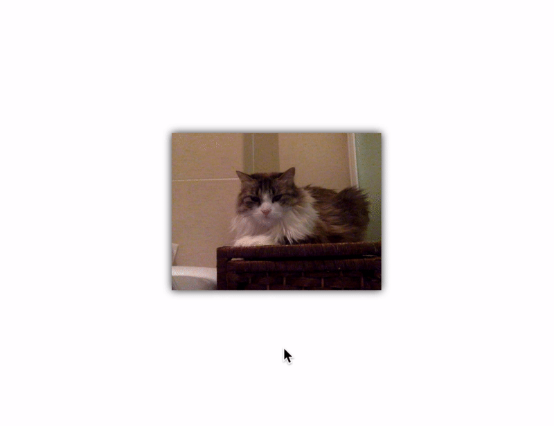

# [Creepyface](https://creepyface.io) &middot; [](https://github.com/4lejandrito/creepyface/blob/master/LICENSE) [](https://www.npmjs.com/package/creepyface) [](https://github.com/4lejandrito/creepyface/actions?query=workflow%3ABuild+branch%3Amaster) [](https://coveralls.io/github/4lejandrito/creepyface?branch=master) <a href="https://twitter.com/intent/follow?screen_name=creepyface_io"></a>

Creepyface is a little JavaScript library that makes your face look at the pointer (or a [firefly](packages/creepyface-firefly)).

See it in action at [creepyface.io](https://creepyface.io) and create your own one using [the wizard](https://creepyface.io/create).

If you use React, check out [\<Creepyface /\>](packages/react-creepyface).



Creepyface in the wild:

- https://atroshenkonikita.com
- https://www.yitzi.dev
- https://1aville.ch/about.html
- https://github.com/reflog/mattermost-plugin-creepy

## Usage

```html
<script src="https://creepyface.io/creepyface.js"></script>


```

> Run this example on [codepen](https://codepen.io/4lejandrito/pen/vbgxEB).

Creepyface will automatically detect your image (thanks to the `data-creepyface` attribute) and make it look at the mouse or fingers depending on which device you are using.

You can add as many Creepyfaces as you want as long as they all have the `data-creepyface` attribute.

If you want to stop Creepyface on a given image:

```js
creepyface.cancel(document.querySelector('img'))
```

### Full list of data attributes

| Name                    | Description                                                                                                                                                                                                         |
| ----------------------- | ------------------------------------------------------------------------------------------------------------------------------------------------------------------------------------------------------------------- |
| `data-creepyface`       | Add this to automatically attach creepyface to your image when the page loads.                                                                                                                                      |
| `data-src-hover`        | The URL of the image to use when the pointer is over your image.                                                                                                                                                    |
| `data-src-look-<angle>` | The URL of the image to use when the pointer forms the specified angle (in degrees) with the center of your image. Add as many as you want.                                                                         |
| `data-timetodefault`    | The amount of time (in milliseconds) after which the default src is restored if no pointer events are received. 1 second by default. 0 means it will never be restored (the image will always look at the pointer). |
| `data-throttle`         | The amount of time (in milliseconds) to wait between src changes. 100 by default.                                                                                                                                   |
| `data-points`           | Optionally, a comma-separated list of point provider names to make your face look at things other than the pointer. See [Super advanced usage](#super-advanced-usage) for more information.                         |

## Advanced usage

For more advanced use cases Creepyface can also be set up via a programmatic API:

```html

```

```js
import creepyface from 'creepyface'

const img = document.querySelector('img')

const cancel = creepyface(img, {
  // Time (in ms) to wait between src updates
  throttle: 100,
  // Image URL to display on hover
  hover: 'https://creepyface.io/img/0/hover',
  // Each of the images looking at a given direction
  looks: [
    { angle: 0, src: 'https://creepyface.io/img/0/0' },
    { angle: 45, src: 'https://creepyface.io/img/0/45' },
    { angle: 90, src: 'https://creepyface.io/img/0/90' },
    { angle: 135, src: 'https://creepyface.io/img/0/135' },
    { angle: 180, src: 'https://creepyface.io/img/0/180' },
    { angle: 225, src: 'https://creepyface.io/img/0/225' },
    { angle: 270, src: 'https://creepyface.io/img/0/270' },
    { angle: 315, src: 'https://creepyface.io/img/0/315' }
  ],
  // Time (in ms) to restore the default image after the last input
  timeToDefault: 1000
})

// at some point restore the original image and stop creepyface
cancel()
```

> Run this example on [codepen](https://codepen.io/4lejandrito/pen/bGdBqzX).

## Super advanced usage

Creepyface will look at the pointer by default, however custom point providers can be defined.

For example, to make your face look at a random point every half a second you need to register a [point provider](packages/creepyface/src/types.d.ts#L5-L8):

```js
import creepyface from 'creepyface'

creepyface.registerPointProvider('random', (consumer, img) => {
  const interval = setInterval(
    () =>
      consumer([
        Math.random() * window.innerWidth,
        Math.random() * window.innerHeight
      ]),
    500
  )
  return () => {
    clearInterval(interval)
  }
})
```

and consume it using the `data-points` attribute:

```html

```

> Run this example on [codepen](https://codepen.io/4lejandrito/pen/ZEYJLrN).

or pass it programmatically:

```html

```

```js
const img = document.querySelector('img')

creepyface(img, {
  points: (consumer, img) => {
    const interval = setInterval(
      () =>
        consumer([
          Math.random() * window.innerWidth,
          Math.random() * window.innerHeight
        ]),
      500
    )
    return () => {
      clearInterval(interval)
    }
  },
  hover: 'https://creepyface.io/img/0/hover',
  looks: [
    { angle: 0, src: 'https://creepyface.io/img/0/0' },
    { angle: 45, src: 'https://creepyface.io/img/0/45' },
    { angle: 90, src: 'https://creepyface.io/img/0/90' },
    { angle: 135, src: 'https://creepyface.io/img/0/135' },
    { angle: 180, src: 'https://creepyface.io/img/0/180' },
    { angle: 225, src: 'https://creepyface.io/img/0/225' },
    { angle: 270, src: 'https://creepyface.io/img/0/270' },
    { angle: 315, src: 'https://creepyface.io/img/0/315' }
  ]
})
```

**Note:** several point providers can work at the same time by using a comma-separated string like `"random,pointer"`.

The following point providers are available out of the box:

- `pointer` for both mouse and touch events. This is the default.
- `mouse` just for mouse events.
- `finger` just for touch events.

The are also external point providers:

- [firefly](packages/creepyface-firefly) to follow a moving firefly on the screen.

## Developing

- `npm run bootstrap` will set up the packages using [Lerna](https://lerna.js.org/).
- `npm start` will spin up local servers for each of the packages.
- `npm test` will run the tests.
- `npm run build` will generate the production scripts under the `dist` folder of each package.

## Contributing

Please feel free to create issues and / or submit pull requests. For the latter, [test cases](packages/creepyface/test/) are very welcome.

## License

MIT, see [LICENSE](LICENSE) for details.

## Big Thanks

Cross-browser Testing Platform and Open Source ❤️ provided by [Sauce Labs][homepage].

[homepage]: https://saucelabs.com
