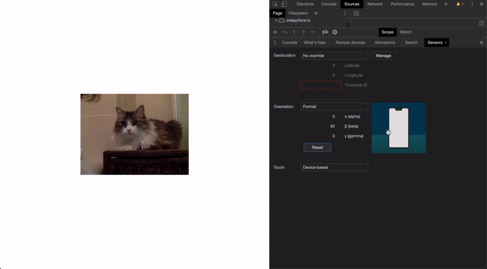

# Creepyface Tilt &middot; [](https://github.com/4lejandrito/creepyface-tilt/blob/master/LICENSE) [](https://www.npmjs.com/package/creepyface-tilt)

A point provider for [Creepyface](https://github.com/4lejandrito/creepyface) to make your face follow the [tilt of your device](https://developer.mozilla.org/en-US/docs/Web/API/Window/deviceorientation_event).



## Usage

```html
<script src="https://creepyface.io/creepyface.js"></script>
<script src="https://unpkg.com/creepyface-tilt"></script>


```

> Run this example on [codepen](https://codepen.io/4lejandrito/pen/qBdRbJj).

## Developing

- `yarn start` will spin up a test page.
- `yarn build` will generate the production scripts under the `dist` folder.
